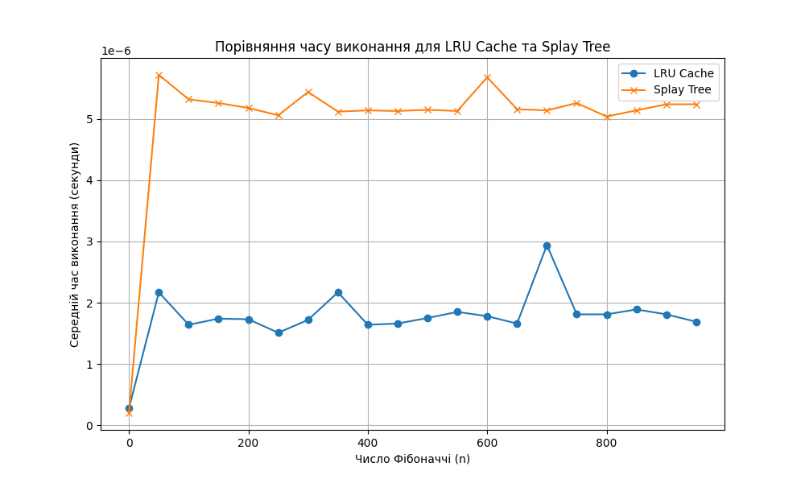
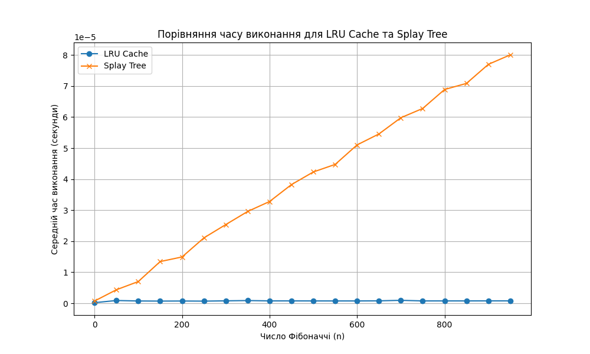

# goit-algo2-hw-07

# Завдання 1. Оптимізація доступу до даних за допомогою LRU-кешу

Реалізуйте програму для оптимізації обробки запитів до масиву чисел за допомогою LRU-кешу.

### Технічні умови:
1. Дано масив розміром N, який складається з позитивних цілих чисел (1 ≤ N ≤ 100_000). Потрібно обробити Q запитів (1 ≤ Q ≤ 50_000) такого типу:

- Range(L, R) — знайти суму елементів на відрізку від індексу L до R включно.
- Update(index, value) — замінити значення елемента в масиві за індексом index на нове значення value.

2. Реалізуйте чотири функції для роботи з масивом:

- range_sum_no_cache(array, L, R) 

Функція має обчислювати суму елементів масиву на відрізку від L до R включно без використання кешу. Для кожного запиту результат має обчислюватися заново.

- update_no_cache(array, index, value) 

Функція має оновлювати значення елемента масиву за вказаним індексом без використання кешу.

- range_sum_with_cache(array, L, R) 

Функція має обчислювати суму елементів на відрізку від L до R включно, використовуючи LRU-кеш. Якщо сума для цього відрізку вже була обчислена раніше, вона має повертатися з кешу, інакше результат обчислюється та додається в кеш.

- update_with_cache(array, index, value) 

Функція має оновлювати значення елемента масиву за вказаним індексом і видаляти всі відповідні значення з кешу, які стали неактуальними через зміну в масиві.

3. Для тестування програми створіть масив розміром 100_000 елементів, заповнених випадковими числами, і згенеруйте 50_000 запитів типу Range та Update у випадковому порядку. 

Приклад списку запитів: [('Range', 46943, 91428), ('Range', 5528, 29889), ('Update', 77043, 78), ...]

4. Використовуйте LRU-кеш розміром K = 1000 для зберігання попередньо обчислених результатів запитів типу Range. Кеш повинен автоматично видаляти найменш недавно використані елементи, якщо досягається його максимальний розмір.

5. Здійсніть порівняння часу виконання запитів:

- Без використання кешу.
- З використанням LRU-кешу.
- Виведіть результати у вигляді часу виконання для обох підходів.


### Критерії прийняття:

1. Усі функції: range_sum_no_cache, update_no_cache, range_sum_with_cache, update_with_cache — реалізовані та працюють.

2. Програма вимірює час виконання запитів з кешем і без нього та виводить результати у зрозумілому вигляді.

3. Результати тестування представлені у зручному для розуміння форматі, щоб можна було оцінити ефективність використання LRU-кешу.

4. Код виконується без помилок і відповідає технічним вимогам.

### Приклад виведення в термінал виконання програми
```
Час виконання без кешування: 3.11 секунд
Час виконання з LRU-кешем: 0.02 секунд
```

# Завдання 2. Порівняння продуктивності обчислення чисел Фібоначчі із використанням LRU-кешу та Splay Tree

Реалізуйте програму для обчислення чисел Фібоначчі двома способами: із використанням LRU-кешу та з використанням Splay Tree для збереження попередньо обчислених значень. Проведіть порівняльний аналіз їхньої ефективності, вимірявши середній час виконання для кожного з підходів.

### Технічні умови:

1. Реалізуйте дві функції для обчислення чисел Фібоначчі:

- fibonacci_lru(n) 

Функція має використовувати декоратор @lru_cache для кешування результатів обчислень. Завдяки цьому вона може повторно використовувати попередньо обчислені значення чисел Фібоначчі.

- fibonacci_splay(n, tree) 

Функція використовує структуру даних Splay Tree для збереження обчислених значень. Якщо число Фібоначчі для заданого n уже було обчислене, значення має повертатися з дерева, інакше значення обчислюється, зберігається у Splay Tree і повертається.

2. Виміряйте час виконання обчислення чисел Фібоначчі для кожного з підходів:

- Створіть набір чисел Фібоначчі від 0 до 950 з кроком 50: 0, 50, 100, 150, ....
- Використовуйте модуль timeit для вимірювання часу виконання обчислень.
- Для кожного значення n обчисліть середній час виконання обчислення числа Фібоначчі з використанням LRU-кешу та Splay Tree.

3. Побудуйте графік, який порівнює час виконання для двох підходів:
- Використовуйте бібліотеку matplotlib для побудови графіка.
- На осі x відобразіть значення n — номер числа Фібоначчі.
- На осі y — середній час виконання в секундах.
- Додайте на графік легенду, яка вказує на два підходи: LRU Cache та Splay Tree.

4. Зробіть висновки щодо ефективності обох підходів на основі отриманого графіка.

5. Додатково до побудови графіка виведіть текстову таблицю, яка містить значення n, середній час виконання для LRU Cache та Splay Tree. Таблиця повинна бути відформатована для зручного читання.

### Критерії прийняття:

1. Реалізовано функції fibonacci_lru та fibonacci_splay, які обчислюють числа Фібоначчі із використанням кешування.

2. Виконано вимірювання часу виконання для кожного підходу на кожному значенні n та побудовано графік, що демонструє результати.

3. Графік має підписи осей, заголовок і легенду, що пояснює, який із методів було використано.

4. Присутня оформлена таблиця з результатами в терміналі.

5. Проведено аналіз результатів на основі отриманого графіка, що демонструє, який підхід є ефективнішим для обчислення чисел Фібоначчі на великих значеннях n.

6. Код виконується й відповідає технічним умовам.

### Приклад таблиці виведення:
```
n         LRU Cache Time (s)  Splay Tree Time (s) 
--------------------------------------------------
0         0.00000028          0.00000020          
50        0.00000217          0.00000572          
100       0.00000164          0.00000532          
150       0.00000174          0.00000526 
```

### Приклад графіка:



# Розв'язок завдання 1. Оптимізація доступу до даних за допомогою LRU-кешу
```
Час виконання без кешу: 2.68281654198654 секунд
Час виконання з LRU-кешем: 2.731641083024442 секунд
```

# Розв'язок завдання 2. Порівняння продуктивності обчислення чисел Фібоначчі із використанням LRU-кешу та Splay Tree
```
n         LRU Cache Time (s)  Splay Tree Time (s) 
--------------------------------------------------
0         0.00000023          0.00000076          
50        0.00000099          0.00000462          
100       0.00000080          0.00000750          
150       0.00000077          0.00001366          
200       0.00000081          0.00001628          
250       0.00000076          0.00002227          
300       0.00000087          0.00002552          
350       0.00000097          0.00003226          
400       0.00000085          0.00003524          
450       0.00000088          0.00004187          
500       0.00000082          0.00004481          
550       0.00000082          0.00004854          
600       0.00000083          0.00005405          
650       0.00000082          0.00005800          
700       0.00000109          0.00006521          
750       0.00000086          0.00006881          
800       0.00000083          0.00007904          
850       0.00000098          0.00007659          
900       0.00000088          0.00008398          
950       0.00000088          0.00008716 
```



На основі отриманого графіка можна зробити наступні висновки:

1. **Ефективність LRU Cache**:
   - На великих значеннях `n` метод з використанням LRU Cache показує стабільно низький час виконання.
   - Це пояснюється тим, що `@lru_cache` оптимально зберігає обчислені значення, і при повторному виклику функції вони миттєво повертаються з кешу.

2. **Ефективність Splay Tree**:
   - Час виконання для підходу з використанням Splay Tree є значно більшим, особливо на великих значеннях `n`.
   - Це обумовлено тим, що навіть з оптимізацією доступу через Splay Tree, кожна операція вставки та пошуку має додаткові витрати на підтримку структури дерева.

3. **Загальний висновок**:
   - Для обчислення чисел Фібоначчі на великих значеннях `n` LRU Cache є значно ефективнішим. Він демонструє майже миттєве виконання завдяки кешуванню результатів та відсутності потреби в додатковій структурі даних.
   - Splay Tree підходить більше для сценаріїв, де кешування виконується динамічно і необхідно зберігати структуру дерева для інших операцій.

Графік наочно показує, що при збільшенні `n` різниця в продуктивності між методами стає більш значною на користь LRU Cache.